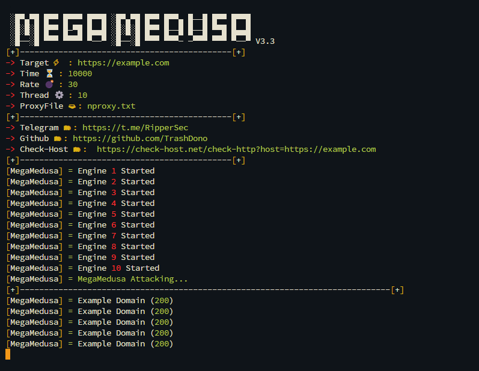

# MegaMedusa Machine Layer-7 DDoS Tool v3.3

## MegaMedusa V3.3 Display :
 

### What is MegaMedusa?
- MegaMedusa is NodeJS DDoS Machine Layer-7 provided by RipperSec Team.
- MegaMedusa Original Developer is TrashDono but re-improved by RipperSec after his death (RiP).

### Usage :
```
Usage: node MegaMedusa.js <link> <time> <rps> <threads> <proxy> 
Example: node MegaMedusa.js https://example.com 500 30 10 proxy.txt 
```

### Installation Command :
```
python3 nvminstall.py
python3 installer.py
------------------------
After this commands installed. Restart your terminal.
```

### Proxy Scrape Command :
```
python3 scrape.py
```

### Instructions :
- **Target**: By entering the victim's link target, you will be able to run a zombie botnet army to attack the victim
- **RPS**: Requests per second: A metric that measures the throughput of a system
- **Threads**: threads is a measure of bytes
- **Proxy**: While using proxy, you will attack in different ip & country and make traffic flooding

### News About MegaMedusa :
- https://www.radware.com/blog/security/2024/08/megamedusa-rippersec-public-web-ddos-attack-tool/
- https://gbhackers.com/megamedusa-ddos-attack-tool/
- https://cyberpress.org/the-ddos-tool-taking-the-hacker-world-by-storm/?amp=1
- https://youtu.be/xGDqfAUwQ94?si=83fYcIl1MA0P2tfm
- https://www.techtalkthai.com/learn-about-rippersec-ddos-attack-tool-megamedusa-by-radware/
- https://diasp.org/posts/24304926
- https://krofeksecurity.com/megamedusa-orodje-ddos-ki-v-svetu-hekerjev-vzbuja-vihar/
  
 ### Security that MegaMedusa can bypass :
- UAM Challenges Bypass ✅
- Cloudflare NoSec ✅
- DDoS Guard Bypass ✅
- vShield Website Bypass ✅
- ShieldSquare Captcha Bypass ✅
  
 ### Update v3.1 :
- Lagging Fixed & More Compatible.
- More power & bypasses.
- Ram & Cpu Usage (Low).
- Fixed Bugs.

 ### Update v3.2 :
- UAM Bypass Challenge Improvement.
- RPS Power Improvement.
- New Ui / Display.
- Auto Restart Attack If Ram Usage Reach 80%
- DDoS Maximum Hold: 100,000K Seconds.
- Device Stuck & Phone Overheating Fixed.
- Script Run More Smoothly Compared to Version 3.1
- VPS/RPD Suspend Problem Solved.

### Update v3.3 (Latest) :
- Script Bypass Improvement.
- Power Improvement.
- New Ui / Display.
- Code Encryption Upgrade
- Domain blocked added.
- Tool will auto removed if you attack blocked domain.
- HTTP2 & HTTP1 attack improved.
- Script work more efisinly.

### Domain block :
    ".bn", ".lb", ".ir", ".ye", "-ye", 
    ".com.ye", ".org.ye", ".id", ".my", "malaysia", ".af", ".sy", ".om",
    ".kw", ".bh", ".uz", ".sd", ".qa", ".jo", ".dz", ".sa", ".pk", ".bd",
    ".ps", ".eg", ".iq", ".ly", ".ae", ".tn", ".so", ".mv", ".km", ".ma",

### OS Support :
- Debian.
- Ubuntu (Recommended).
- Kali Linux.
- Termux.
- Windows.

### Minimum Device Specifications :
- 4GB Ram.
- 2 Core.
- Internet Speed Minimum 30mbps.

## Refference :
<a href="https://t.me/RipperSec"></a>

## If you want to donate,  :
```
bc1q5z9kccxvwcx6dk9hsmezvhfg8yqjyj0hs3v52v (BTC)
```

## Disclaimer :
- This tool only for Education, Pentesting, and Research Purposes!
MegaMedusa Power depends from your Device Specs. Don't blame this script not power if your phone sucks.